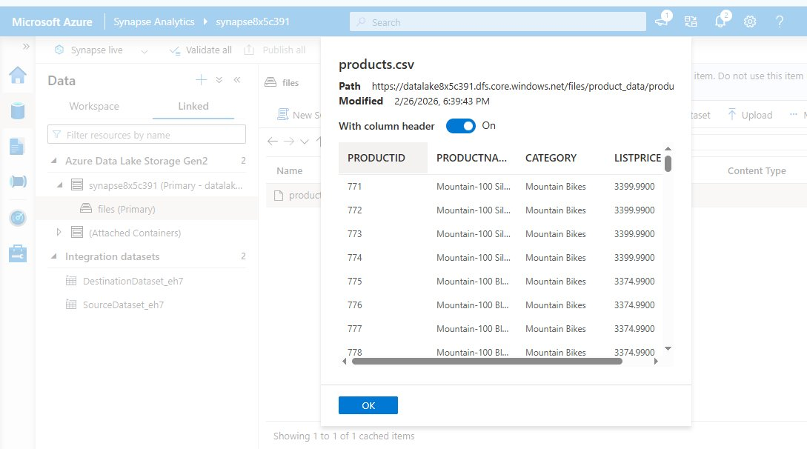
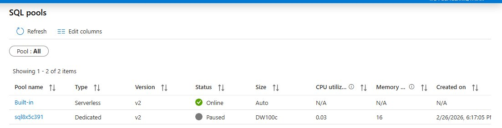
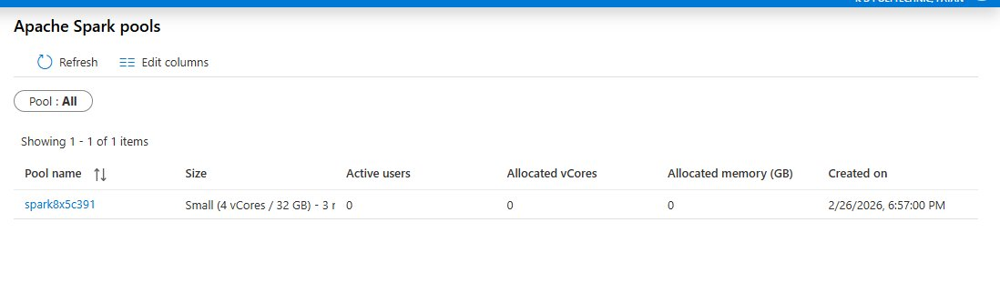

# 📊 Azure Synapse Analytics — Data Analysis Project

## Overview
This project demonstrates how to use Azure Synapse Analytics to ingest, store, and analyze data using multiple tools — Serverless SQL Pool, Apache Spark Pool, and Dedicated SQL Pool.

## Project Screenshots
### Products Data in Data Lake


### SQL Pools Status


### Spark Pool Status


---

## Architecture
```
Internet (HTTP)
      ↓
Azure Data Factory Pipeline
      ↓
Azure Data Lake Storage Gen2
(files/product_data/products.csv)
      ↓
   ┌──────────────────────────┐
   │                          │
Serverless SQL Pool      Apache Spark Pool
(SQL queries on files)   (Python/PySpark analysis)
```

---

## Technologies Used
- **Azure Synapse Analytics** — Main analytics platform
- **Azure Data Lake Storage Gen2** — File storage
- **Serverless SQL Pool** — Query files directly using SQL
- **Apache Spark Pool** — Big data processing using Python
- **Dedicated SQL Pool** — Enterprise data warehouse
- **Azure Data Factory Pipeline** — Data ingestion

---

## Project Structure
```
synapse-analytics-azure/
│
├── README.md                          ← Project description
├── .gitignore                         ← Secrets excluded
├── queries/
│   └── Count_Products_by_Category.sql ← SQL analysis query
├── notebooks/
│   └── Explore_Products.ipynb         ← PySpark notebook
└── screenshots/
    ├── products_preview.png           ← Data Lake preview
    ├── sql_pools.png                  ← SQL pools status
    └── spark_pools.png                ← Spark pool status
```

---

## What Was Done

### Step 1 — Data Ingestion with Pipeline
- Created a Copy Data pipeline in Synapse Studio
- Source: products.csv from HTTP (internet)
- Destination: Azure Data Lake Gen2 (files/product_data/)
- Pipeline ran successfully and copied data ✅

### Step 2 — Serverless SQL Pool Analysis
- Queried products.csv directly from Data Lake using SQL
- Used OPENROWSET to read CSV file without loading into table
- Counted products by category using GROUP BY
- Saved query as "Count Products by Category" ✅

### Step 3 — Apache Spark Pool Analysis
- Loaded products.csv into a Spark DataFrame using PySpark
- Displayed first 10 rows
- Grouped by Category and counted products
- Visualized results in Chart view ✅

---

## Key Queries

### SQL Query — Count Products by Category
```sql
SELECT Category, COUNT(*) as total_count
FROM OPENROWSET(
    BULK 'https://datalake8x5c391.dfs.core.windows.net/files/product_data/products.csv',
    FORMAT = 'CSV',
    PARSER_VERSION='2.0',
    HEADER_ROW = TRUE
) AS [result]
GROUP BY Category
```

### PySpark — Load and Analyze Data
```python
# Load CSV into DataFrame
df = spark.read.load('abfss://files@datalake8x5c391.dfs.core.windows.net/product_data/products.csv',
    format='csv', header=True)
display(df.limit(10))

# Count products by category
df_counts = df.groupBy(df.Category).count()
display(df_counts)
```

---

## Key Learnings
- How to ingest data using Azure Data Factory pipelines
- How to query files in Data Lake using Serverless SQL Pool
- How to analyze data using Apache Spark with PySpark
- Difference between Serverless SQL Pool and Dedicated SQL Pool
- How to use OPENROWSET to read files directly without loading

---

## Author
Built as part of Microsoft Azure Synapse Analytics learning path.
